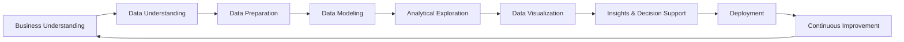
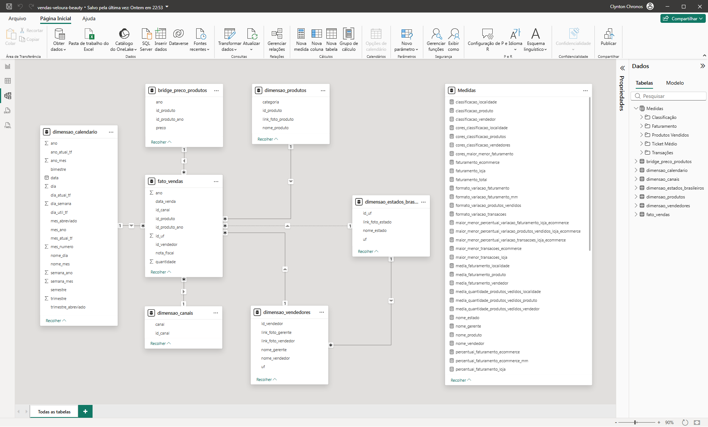
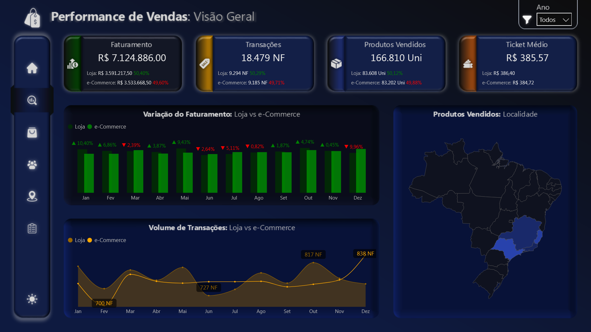

# Projeto Vendas — Veloura Beauty
  

## 📊 Visão Geral

Este projeto apresenta um **dashboard de análise de vendas desenvolvido em Power BI**, criado para monitorar a performance comercial da empresa fictícia **Veloura Beauty**.

A solução permite acompanhar indicadores estratégicos de vendas, identificar padrões de comportamento, avaliar a eficiência de produtos, vendedores e regiões, além de apoiar decisões estratégicas orientadas por dados.

🔎 **[Dashboard Interativo](https://app.powerbi.com/view?r=eyJrIjoiYjI5ZjFkOTEtNmI5YS00OGRlLThjMDQtNzliNzczNWY1MGJiIiwidCI6IjIzY2FjN2VlLWYxZDgtNDMzOS1hYTdiLTc4MWFhOWY5MjI1YiJ9)**  

---

## 🧠 Contexto do Problema

A operação comercial da **Veloura Beauty** enfrentava desafios na análise integrada de:

- desempenho por canal de venda
- desempenho de vendedores
- eficiência de produtos
- variação de performance entre regiões

Essas limitações dificultavam a identificação rápida de oportunidades e gargalos comerciais, impactando diretamente a tomada de decisão estratégica e a performance de vendas.

---

## 🎯 Abordagem Estratégica

Para resolver esses desafios, foi desenvolvida uma solução analítica utilizando **Power BI**, estruturada com **modelagem dimensional** e definição de indicadores estratégicos de performance.

O dashboard foi projetado para oferecer:

- leitura executiva clara
- análise comparativa entre canais de venda
- navegação intuitiva entre diferentes dimensões do negócio  

### KPIs principais

- Faturamento
- Transações
- Produtos Vendidos
- Ticket Médio

---

## 🧠 Metodologia Aplicada — BOSS BI Framework

> Este projeto foi desenvolvido utilizando o BOSS BI Framework (Business-Oriented Smart Solutions), uma metodologia proprietária desenvolvida para estruturar projetos de Business Intelligence e Analytics, focada na geração de valor estratégico, consistência analítica e suporte à tomada de decisão.

## 🔷 Fluxo do BOSS BI Framework

## 📌 Detalhamento das Etapas

### 🔹 1. Business Understanding
Definição do problema analítico e alinhamento com os objetivos estratégicos do negócio, garantindo que a solução gere valor real e mensurável.

---

### 🔹 2. Data Understanding
Mapeamento das fontes de dados e análise inicial para compreensão da estrutura, qualidade e granularidade das informações disponíveis.

---

### 🔹 3. Data Preparation
Tratamento, limpeza e transformação dos dados, assegurando consistência, padronização e confiabilidade para análise.

---

### 🔹 4. Data Modeling
Estruturação do modelo de dados utilizando boas práticas de modelagem dimensional, com foco em performance e escalabilidade.

---

### 🔹 5. Analytical Exploration
Exploração dos dados para identificação de padrões, tendências, correlações e possíveis anomalias relevantes ao negócio.

---

### 🔹 6. Data Visualization
Desenvolvimento de dashboards e relatórios interativos, aplicando princípios de visualização e Data Storytelling.

---

### 🔹 7. Insights & Decision Support
Geração de insights acionáveis e recomendações estratégicas para apoiar a tomada de decisão baseada em dados.

---

### 🔹 8. Deployment
Publicação e disponibilização da solução analítica, garantindo acesso, atualização e governança dos dados.

---

### 🔹 9. Continuous Improvement
Monitoramento contínuo e evolução da solução, adaptando-se às mudanças e novas necessidades do negócio.

---

## 📈 Impactos e Resultados

A solução permite:

- identificar rapidamente **produtos de alta e baixa performance**
- analisar **vendedores com maior eficiência comercial**
- detectar **padrões de comportamento de vendas**
- monitorar **regiões com maior potencial de crescimento**

Com isso, gestores conseguem tomar decisões mais rápidas e baseadas em dados.

---

## 🧩 Estrutura do Dashboard

### 📊 **Indicadores Principais**

O dashboard apresenta quatro cartões principais:

### Faturamento

- valor total de vendas realizadas
- comparação entre canais loja e e-Commerce

### Transações

- quantidade total de vendas (notas fiscais)
- distribuição entre canais de venda

### Produtos Vendidos

- volume total de itens comercializados
- análise comparativa entre loja e e-Commerce

### Ticket Médio

- valor médio por transação
- comparação entre canais de venda

---

## 📊 Visualizações Analíticas

### 📈 **Faturamento: Loja vs e-Commerce**

Gráfico de barras clusterizadas mostrando:

- comparação do faturamento entre os canais loja e e-Commerce
- análise mensal de desempenho
- identificação de variações e diferenças entre os canais

---

### 🧾 **Transações: Loja vs e-Commerce**

Gráfico de linhas que apresenta:

- volume de transações por período
- comportamento dos canais de venda
- análise de tendências

---

### 📦 **Produtos Vendidos: Loja vs e-Commerce**

Gráfico de barras verticais mostrando:

- volume de produtos vendidos por período
- comparação entre canais
- identificação de oscilações

---

### 🧠 **Eficiência: Volume vs Faturamento**

Gráfico de dispersão exibindo:

- relação entre quantidade vendida e faturamento
- classificação de produtos e vendedores (matriz BCG)
- identificação de padrões de performance

---

### 🗺️ **Distribuição Geográfica**

Mapa destacando:

- performance por estado
- identificação de regiões com maior relevância
- análise de concentração de vendas

---

### 🧩 **Categorias de Produtos**

Gráfico **Rosca** exibindo:

- distribuição de vendas por categoria
- participação percentual de cada segmento

---

## 🎛️ Filtros Interativos

O dashboard permite análise dinâmica por:

- **Ano**
- **Produto**
- **Vendedor**
- **Localidade**

Esses filtros permitem explorar diferentes perspectivas de análise.

---

## 🎨 Experiência de Navegação

O dashboard inclui recursos de usabilidade e design:

Barra de Menu Lateral

- 🏠 **Início**
- 🔎 **Visão Geral**
- 🎁 **Análise por Produto**
- 👤 **Análise por Vendedor**
- 🚩 **Análise por Localidade**
- 💬 **Conclusão**
- 🌙 **Modo Dark (padrão)**
- ☀️ **Modo Light (opcional)**

Esses elementos melhoram a experiência de exploração dos dados.

---

## 🛠️ Stack Técnica

- Power BI
- Power Query
- DAX (Data Analysis Expressions)
- Modelagem Dimensional
- Storytelling com Dados
- PowerPoint

---

## 🧱 Modelagem de Dados

⭐ **Star Schema**

Neste projeto, foi adotado o modelo Star Schema como padrão de modelagem dimensional, priorizando performance analítica, simplicidade estrutural e eficiência no processamento de dados.  

A utilização de dimensões desnormalizadas e relacionamentos diretos com a tabela fato reduz a complexidade de junções, melhora a compressão de dados no mecanismo VertiPaq e garante maior previsibilidade no comportamento dos filtros e medidas.

Essa abordagem é amplamente recomendada em soluções de Business Intelligence, especialmente no Power BI, por proporcionar melhor desempenho e facilitar a construção de análises escaláveis e intuitivas.

### **Tabelas Fato**

- vendas

### **Tabelas Dimensão**

- calendário
- preços dos produtos
- canais
- produtos
- estados brasileiros
- vendedores

Com isso, a solução proporciona maior visibilidade comercial, permitindo a identificação de padrões de vendas, análise de performance por diferentes dimensões do negócio e suporte mais assertivo à tomada de decisão estratégica.

## 🗂️ Modelo de Dados

  

O modelo foi projetado para suportar evolução futura, incluindo a possibilidade de integração com tabelas fato adicionais ou resolução de cenários de muitos-para-muitos por meio de tabelas bridge.

---

## 📸 Preview do Dashboard

## Documentação das Medidas

Para consultar a documentação das medidas deste projeto, suas fórmulas e descrições, acesse a **[Documentação das Medidas](docs/medidas-documentacao.md)**.

## 👨‍💻 Autor

Projeto desenvolvido como parte do meu portfólio profissional em **Business Intelligence e Data Analytics**, destacando habilidades avançadas e aplicáveis a diversos cenários analíticos:

- Desenvolvimento de **dashboards executivos e painéis estratégicos**, focados em insights acionáveis e tomada de decisão baseada em dados  
- **Modelagem dimensional e relacional**, aplicando corretamente **cardinalidade, granularidade** e hierarquias entre tabelas para garantir consistência e integridade dos dados  
- **Transformação de dados com Power Query e Linguagem M**, criando pipelines eficientes, automatizados e auditáveis  
- Criação de **KPIs estratégicos e métricas customizadas em DAX**, para análise de performance e comparações confiáveis  
- **Integração de múltiplas fontes de dados** (Excel, SQL, APIs, arquivos planos), padronizando e validando informações críticas  
- **Data storytelling e visualizações interativas**, com cores, hierarquias, filtros e destaque de insights, para facilitar interpretação e engajamento do usuário  
- **Análises estatísticas e preditivas**, usando Python, R, regressões, teste de hipóteses, séries temporais e técnicas de Machine Learning para identificação de tendências e padrões  
- **Automatização e otimização de processos analíticos**, incluindo ETL, scripts e compressão de dados, garantindo performance e escalabilidade dos relatórios  
- **Documentação detalhada de medidas, tabelas, modelos e processos**, permitindo reprodutibilidade, transparência e governança dos dados  
- Aplicação de **boas práticas de engenharia de dados**, integrando análise, estatística, IA e visualização para soluções analíticas completas e confiáveis  
- Domínio completo de **Power BI, DAX, Power Query, Python e R**, com foco em performance, qualidade e entrega de insights estratégicos

---

  
**Portfólio de Business Intelligence & Data Analytics**  

---

💼 Aberto a oportunidades em Business Intelligence & Data Analytics

| [LinkedIn](https://www.linkedin.com/in/rogério-clynton-ribeiro/) | [Portfólio](https://clyntonboss.github.io/) | [e-Mail](mailto:clyntonribeiror@gmail.com) | [WhatsApp](https://wa.me/5524999240768) |

